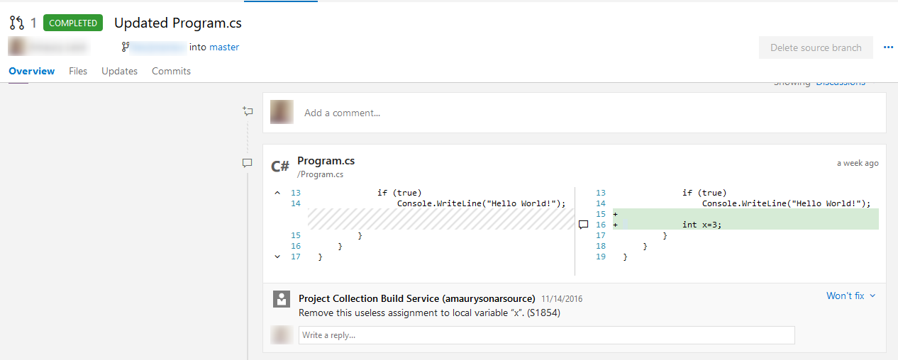
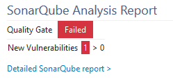

**[SonarQube][sq]** is an open source, static, source code analysis solution that enables continuous tracking of bugs, code smells and vulnerabilities in more than 20 different languages such as C#, VB .Net, Java, C, C++, COBOL, JavaScript, ... 

SonarQube can be installed and run locally on a dedicated infrastructure, or consumed as a service through **[SonarQube.com][sqcom]**. This free-of-charge service is currently dedicated to open source projects.

The analysis of the source code doesn't happen on the server side, but must be part of the build chain to make the analysis as accurate as possible. These analysis are performed using SonarQube Scanners.

## About the SonarQube VSTS Marketplace Extension
This extension provides the following features:
* A dedicated **SonarQube EndPoint** to define the SonarQube server to be used.
* Two build tasks to analyze Visual Studio Solutions:
  * **SonarQube Scanner for MSBuild - Begin Analysis** task, to prepare the analysis before executing the build.
  * **SonarQube Scanner for MSBuild - End Analysis** task, to complete the analysis after the build.
* A **SonarQube Scanner CLI** build task to analyze non-Visual Studio solutions such as PHP or JavaScript projects.

## Highlighted Features
### Seamless Integration with .Net projects
The analysis of C# and VB. Net solution is really straightforward since it only requires adding the two **SonarQube Scanner for MSBuild** tasks to your build definition.

### Pull Request Analysis for .Net projects
When the analysis is triggered from a Pull Request, instead of pushing the analysis report to the SonarQube server, the **SonarQube Scanner for MSBuild - End Analysis** task decorates the updated source code, in the Pull Request, with the new code quality issues.

Example of a Pull Request Analysis comment: 

### Quality Gate Status
By default, the **SonarQube Scanner for MSBuild - End Analysis** task waits for the SonarQube analysis report to be consumed in order to flag the build job with the Quality Gate status. The Quality Gate is a major, out-of-the-box, feature of SonarQube. It provides the ability to know at each analysis whether an application passes or fails the release criteria. In other words it tells you at every analysis whether an application is ready for production "quality-wise".

Example of a passing Quality Gate:
 

Example of a failing Quality Gate:

This [Get Started][getstarted] guide provides all the required documentation for you to setup a build definition.

   [sq]: <https://www.sonarsource.com/why-us/products/sonarqube/>
   [sqcom]: <https://sonarqube.com/>
   [getstarted]: <http://redirect.sonarsource.com/doc/install-configure-scanner-tfs-ts.html>