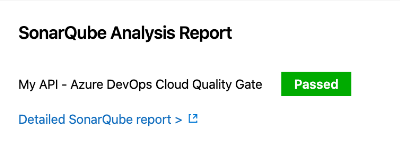
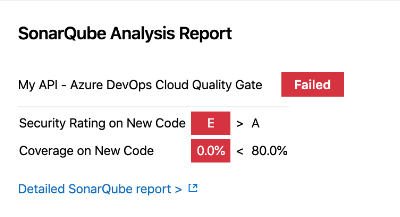

**[SonarQube][sq]** is the leading tool for continuously inspecting the Code Quality and Security of your codebases, all while empowering development teams. Covering 25+ programming languages including C#, VB.Net, JavaScript, TypeScript and C++; SonarQube easily pairs up with your Azure DevOps environment and tracks down bugs, vulnerabilities and code smells. With over 170,000 deployments helping small development teams as well as global organizations, SonarQube provides the means for all teams and companies around the world to own and impact their Code Quality and Security.

This extension provides build tasks that you incorporate into your build definition(s) to enable additional SonarQube functionality in Azure DevOps environments.

_Note: this extension is officially supported for use with Azure DevOps Server (formerly TFS). Ongoing interoperability with Azure DevOps Services (cloud-based) is not assured._

## Benefits of the SonarQube Azure DevOps Marketplace Extension

### Quality Gate™ status publishing
A Quality Gate™ is a Pass/Fail status indicator that clearly lets you know if your code is clean and safe. SonarQube comes with a default Quality Gate called SonarWay™ that's built-in and ready to use. When you see a 'Green' Quality Gate, you know that your application is releasable and your team is hitting the mark! Using this extension, SonarQube publishes Quality Gate status right to your build results.

Example of a passing Quality Gate:

Example of a failing Quality Gate:

### Automatically analyze branches and decorate Pull Requests*
 This extension allows automatic analysis of all branches and pull-requests which enables early discovery of bugs and vulnerabilities prior to a merge. Branches and PRs get their own Quality Gate status and results are pushed right to your project space. 

If you configure your build definition as a build validation for pull requests of that project (this can be done in 'Branch Policies'), SonarQube will also analyze the code changes and decorate the pull request with comments and overall status so that you can merge with confidence.

When a build is run on a branch, the extension automatically configures the analysis to be pushed to the relevant project branch on SonarQube.

**Important note**: to activate pull request decoration, you must specify a user token in the "General Settings > Pull Requests" administration page of your project in SonarQube.

*Available with SonarQube Developer Edition and above.

## About the SonarQube Azure DevOps Marketplace Extension
This extension provides the following features:
* A dedicated **SonarQube EndPoint** that defines the SonarQube server to be used.
* Branch and **Pull Request** analysis in your projects.
* Three build tasks to get your projects analyzed easily:
  * **Prepare Analysis Configuration:** Configures all the required settings prior to executing a build. This task is mandatory. For .NET solutions or Java projects, this task helps SonarQube seamlessly integrate with MSBuild, Maven and Gradle tasks.
  * **Run Code Analysis:** Executes the source code analysis. This task isn't required for Maven or Gradle projects.
  * **Publish Quality Gate Result:** Displays the Quality Gate status in the build summary. This tasks is optional, as it may increase the overall build time.

**Note for TFS installations older than TFS 2017 Update 2**: to install the extension, please follow instructions
available on the ["SonarQube Extension 3.0" documentation page](https://docs.sonarqube.org/display/SCAN/SonarQube+Extension+3.0).

## Highlights
### Seamless integration with .NET solutions
C# and VB.NET analysis is simple and straightforward and only requires adding the **Prepare Analysis Configuration** and **Run Code Analysis** tasks to your build definition.

### Easy setup for Maven and Gradle projects
For Java, analyzing your source code is also very easy. It only requires adding the **Prepare Analysis Configuration** task and checking the **Run SonarQube Analysis** option in the 'Code Analysis' panel in your Maven or Gradle task.

This [Get Started][getstarted] guide provides all the required documentation to set up your build definition.

   [sq]: <https://www.sonarsource.com/products/sonarqube/>
   [getstarted]: <http://redirect.sonarsource.com/doc/install-configure-scanner-tfs-ts.html>
